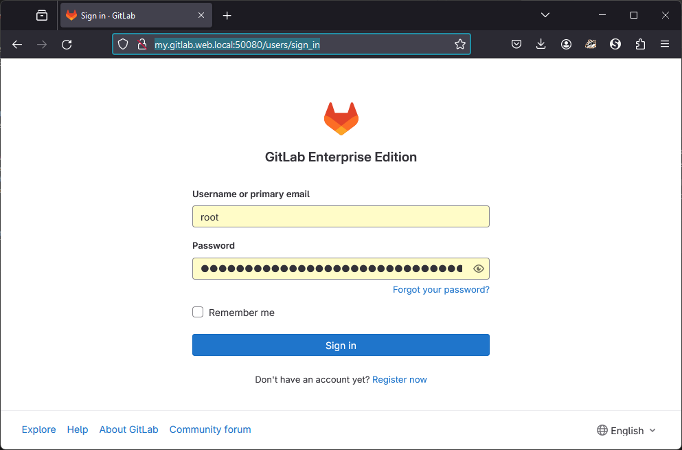

# GitLab Solution Zero

The solution presented in this folder is to be considered a starting point for simple deployments for individuals or teams that are just starting with GitLab private deployments.

## Quick Start

- Clone this repository on a machine able to run docker compose projects.
- Ensure that you can observe the contents of the volumes
  - For example, when using Rancher Desktop on Windows, the contents of the volumes are visible in the folder `\\wsl.localhost\rancher-desktop\var\lib\docker\volumes `
- Set up a local hostname in the hosts file matching the one declared in the `.env` file
  - For example, when using Rancher Desktop on Windows, add the following line in the file `C:\Windows\System32\drivers\etc\hosts`

      ```txt
      127.0.0.1 my.gitlab.web.local
      ```

  - This is necessary because [GitLab requires the hostname and the external url](https://docs.gitlab.com/ee/install/docker.html#install-gitlab-using-docker-compose) to be known at start time.
- run the docker compose project

    ```sh
    cd <path>/GitLabSolutionZero
    docker compose up
    ```

- The first run will populate the volumes. Inside the volume `gitlabsolutionzero_web-config` there will created a file called `initial-root-password`. Use the contents for the first login.
- Also, the first run will require a few minutes to initialize the system. As the `runner` service is set to start after the `web` service is healthy, watch the logs for the moment the runner begins to log. It means you can open the browser to the configured port and start working.

    ```url
    http://my.gitlab.web.local:50080
    ```
    

    Afterwards, got to the runners registration page:

    ```url
    http://my.gitlab.web.local:50080/admin/runners
    ```

    and register a new runner by following the link "Create a new runner". Choose Linux, add a tag and create.

    The web page will give you a registration command to use in the runner, like the one below:

    ```sh
    gitlab-runner register \
    --url http://my.gitlab.web.local:50080 \
    --token glrt-axyCw8Lc5V8Yh5L1BrBm
    ```
    

- To register the runner:
  - On the host running the docker compose project open a shell inside the runner:

      ```sh
      docker exec -it gitlab-runner sh
      ```
  
  -Inside the shell, run the provided command and answer the questions. Choose the docker executor.

      ```sh
      gitlab-runner register \
      --url http://my.gitlab.web.local:50080 \
      --token glrt-axyCw8Lc5V8Yh5L1BrBm
      ```

## Backup and restore

All the data is held in docker volumes. A simple strategy for backup and restore is to save and eventually restore the volumes when the processes are shut off.

### Take a backup

```sh
# shutdown the project
docker compose down -t 100

docker compose -f ./docker-compose_make_backup.yml run --rm bak-web
docker compose -f ./docker-compose_make_backup.yml run --rm bak-runner

# start the services in the poject
docker compose up -d
```

### Restore a backup

First decide which backup to restore, by timestamp. E.g. f the chosen backup is `bk_24-01-07T22.28.47`, then copy or move its contents in the father directory.

Destroy the service, stop and delete the volumes. Restoring a backup cannot merge the volumes.

```sh
docker compose down -t 0 -v # 
```

Then restore the contents of the volumes

```sh
docker compose -f ./docker-compose_restore_backup.yml run --rm res-web
docker compose -f ./docker-compose_restore_backup.yml run --rm res-runner
```

Start the services in the project

```sh
docker compose up -d
```

